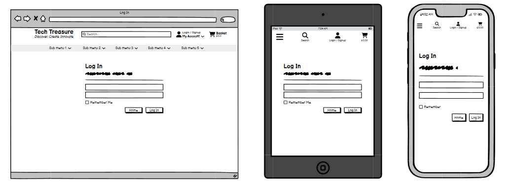
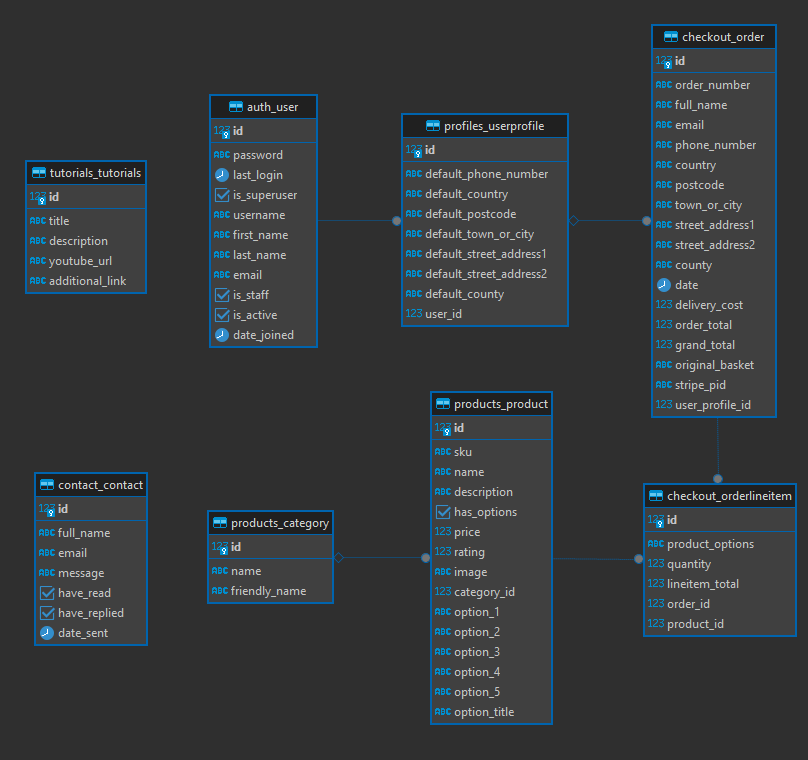

# [TECH TREASURES](https://tech-treasures-7e2b33714eb6.herokuapp.com)

Tech Treasures is a specialized platform tailored for tech enthusiasts, hobbyists, professionals, and innovators seeking access to high-quality tech components, gadgets, resources, and educational materials. Serving as a comprehensive marketplace, Tech Treasures streamlines the process of discovering and acquiring essential tools while fostering collaboration, knowledge-sharing, and growth within the technology and electronics realm.

At its core, Tech Treasures prioritizes user experience by offering a user-friendly interface, secure transactions, fast shipping, and exceptional customer support. The platform focuses on providing access to essential tech tools and resources, enabling individuals to explore, learn, innovate, and grow within their respective fields, making Tech Treasures a valuable resource for individuals passionate about technology and electronics.


[View the live site here.](https://tech-treasures-7e2b33714eb6.herokuapp.com/)

## UX

At Tech Treasures, the UX design process begins with understanding the core needs and expectations of its target audience—tech enthusiasts, professionals, and innovators. The platform emphasizes simplicity and clarity in its interface, focusing on intuitive navigation and clear categorization of tech components and resources. Design prototypes are crafted to visualize user interactions, ensuring ease of use and accessibility across devices. Through iterative design and feedback loops, the platform refines its features, emphasizing secure and streamlined transaction flows. Continuous testing and refinement post-implementation allow Tech Treasures to adapt and enhance the user journey, prioritizing usability, convenience, and engagement without extensive prior research.

### Colour Scheme

- `#000000` used for primary and secondary text.
- `#FFFFFF` used for primary and secondary text.
- `#222222` used for secondary highlights.
- `#8BA6C0` used for placeholder text.
- `#197BDD` used for background colours.

These are the main colours that have been used throughout the site.

I used [coolors.co](https://coolors.co/197bdd-17a2b8-ffffff-8ba6c0-222222-000000) to generate my colour palette.

These are the colours taken from Bootstrap and used on the toasts.

I used [coolors.co](https://coolors.co/17a2b8-ffc107-dc3545-28a745) to show the colours used from bootstrap.

### Typography

The 'Share Tech Mono' was choosen as I felt it's straight lines and sharp corners fit well with the theme of the site and almost looks like the tracks of a circuit board in some respects.

- [Share Tech Mono](https://fonts.google.com/specimen/Share+Tech+Mono) was used for throughout the site.
- [Font Awesome](https://fontawesome.com) icons were used throughout the site, such as the social media icons in the footer.

## User Stories

### New Site Users

- As a new site user, I would like to easily navigate to the main categories of products, so that I can quickly identify what the site offers.
- As a new site user, I would like a responsive site layout that adjusts to my device's screen size, so that I can have a consistent experience whether on desktop, tablet, or mobile.
- As a new site user, I would like to see my purchase total at all times, so that I don't overspend.
- As a new site user, I would like to see social media icons prominently displayed, so that I can follow the company on my preferred platforms for updates.
- As a new site user, I would like a clear and straightforward checkout process, so that I can finalize my purchase smoothly.

### Returning Site Users

- As a returning site user, I would like a secure login and registration process, so that I can protect my personal information.
- As a returning site user, I would like a dashboard where I can view and manage my orders, so that I can track my purchases and manage my account effectively.
- As a returning site user, I would like to easily edit my personal information, so that I can update my details as needed.
- As a returning site user, I would like to have access to my order history, so that I can review past purchases and track order statuses.
- As a returning site user, I would like to receive email confirmation when I register, so that I can verify my account easily.

### Site Admin

- As a site administrator, I should be able to add new products.
- As a site administrator, I should be able to edit existing products.
- As a site administrator, I should be able to remove items from sale as necessary.
- As a site administrator, I should be able to easily access the sites admin pages.

## Wireframes

To follow best practice, wireframes were developed for mobile, tablet, and desktop sizes.
I've used [Balsamiq](https://balsamiq.com/wireframes) to design my site wireframes.

### Mobile Wireframes

<details>
<summary>Home</summary>


</details>

<details>
<summary>Log In</summary>



</details>

<details>
<summary>Sign Up</summary>


</details>

<details>
<summary>Products</summary>


</details>

<details>
<summary>Product Details</summary>


</details>

<details>
<summary>Basket</summary>


</details>

<details>
<summary>Product Management</summary>


</details>

<details>
<summary>Checkout</summary>


</details>

<details>
<summary>Checkout Success</summary>


</details>

<details>
<summary>Profile</summary>


</details>

<details>
<summary>Order History</summary>


</details>

<details>
<summary>Order History</summary>


</details>

<details>
<summary>Order History</summary>


</details>

## Features

### Existing Features

<details>
<summary>Navigation</summary>

The page header serves as a central hub for users, featuring essential links to account controls, shopping basket, and a search bar. Additionally, multiple dropdown menus are strategically placed, offering efficient navigation to distinct product categories. This layout streamlines user access to key functionalities, enhancing overall usability by providing a clear and organized pathway to different sections of the site.


</details>

<details>
<summary>Feature Cards Navigation</summary>

Six strategically placed cards beneath the hero image act as navigation tools, each featuring links to the three primary manufacturers and three main product categories available on the site. Serving as efficient gateways, these cards provide users with direct access to key sections, simplifying the exploration of specific manufacturers and product categories. This layout optimizes user experience by offering a visually intuitive and direct path to essential areas of interest on the platform.


</details>

<details>
<summary>Footer</summary>

The footer presents links to social media platforms, a tutorials section, and a contact page for user convenience. Additionally, a succinct "About Us" section offers a brief overview of the site sellers, providing visitors with insight into the platform's origins and ethos. This section aims to establish transparency and trust by sharing key information about the individuals behind the site.


</details>

<details>
<summary>Product lists with Pagination</summary>

Utilizing a pagination system, the product list page displays 12 items per page, ensuring a manageable and organized browsing experience. The inclusion of a sorting feature allows users to customize their view. Each product entry showcases an image, title, price, category, and rating, facilitating quick comparisons. Clicking on a product directs users to its dedicated details page, providing comprehensive information and maintaining a seamless transition from product overview to in-depth details.


</details>

<details>
<summary>Product Details</summary>

The product details page offers a comprehensive view, featuring essential information such as title, price, category, rating, and a detailed product description. Users can easily adjust the quantity with intuitive increase and decrease buttons, and the "Add to Basket" option streamlines the purchasing process. For products with additional options, like different memory capacities (e.g., 4GB or 8GB), users can toggle between choices using dedicated buttons, allowing for a seamless and customizable shopping experience.


</details>

<details>
<summary>Toast Messages</summary>

The site employs toast messages to deliver brief, unobtrusive notifications. These messages serve to provide users with real-time feedback on actions such as successful additions to the shopping basket, updates on order status, or alerts for any completed transactions. By discreetly conveying important information, toast messages enhance user awareness and contribute to a smooth and transparent interaction with the site.


</details>

<details>
<summary>Shopping Basket</summary>

The shopping basket consolidates selected items, displaying their titles, quantities, individual prices, and a subtotal. Users can easily modify quantities, remove items, or proceed to checkout. Clear and intuitive, the shopping basket serves as a dynamic summary, allowing users to review and manage their selected products before finalizing their purchase.


</details>

<details>
<summary>Checkout</summary>

The checkout process guides users through a secure and streamlined procedure to complete their purchase. It includes steps for entering shipping details, selecting payment methods, and reviewing the order summary. Users can efficiently confirm and place their order, ensuring a straightforward and secure transition from product selection to finalizing the transaction.


</details>

<details>
<summary>Account Accesibility Depending on User Privilges</summary>

Accessible via a dropdown menu, the "My Account" section caters to users with varying privileges, providing tailored access to different parts of the site. This personalized navigation allows users to manage their profiles, track orders, and access exclusive features based on their account permissions. The dropdown ensures a user-centric experience by presenting relevant options and functionality, enhancing the overall usability and convenience of the site.

  

</details>

<details>
<summary>Product Management</summary>

Exclusive to super users, the product management feature empowers administrators with the capability to add, edit, and delete products. This functionality ensures a streamlined process for maintaining the product catalog, allowing for efficient updates, additions, and removals. Tailored for advanced users, this tool enhances the overall control and customization of the site's product offerings.


</details>

<details>
<summary>Profile Management</summary>

The profile page provides users with the ability to update personal details, ensuring accurate and current information. Additionally, users can conveniently access their order history, allowing them to review past purchases, track deliveries, and gain a comprehensive overview of their transactional history on the site. This feature contributes to a user-centered experience by facilitating account management and offering insights into their engagement with the platform.


</details>

<details>
<summary>Tutorials Page</summary>

The tutorials page serves as a curated repository, featuring links to valuable YouTube videos relevant to the site's offerings. Each video is accompanied by a brief description, providing users with insights into the content before they click. This resourceful page is designed to enhance user learning and engagement by offering easy access to educational material while maintaining a concise and informative presentation.


</details>

<details>
<summary>Contact Page</summary>

Exclusively featuring a contact form, our contact page streamlines user communication. This simple yet effective form allows users to submit inquiries or messages directly through the website, promoting a convenient and efficient means of contact.


</details>

<details>
<summary>Admin Contact Page</summary>

Designed in an email client format, the admin contact page presents a tabulated view with rows containing sender details, the date sent, and an indication of whether a reply has been dispatched. Administrators have the functionality to respond to messages and the option to delete entries, providing an organized and responsive interface for managing user inquiries effectively. On smaller screens, the admin contact page optimizes space by intelligently hiding some columns, making them accessible through a dropdown that expands the row downward. This responsive design ensures a seamless user experience, allowing administrators to efficiently manage contact details even on devices with limited screen real estate.


</details>

## Tools & Technologies Used

- [HTML](https://en.wikipedia.org/wiki/HTML) used for the main site content.
- [CSS](https://en.wikipedia.org/wiki/CSS) used for the main site design and layout.
- [JavaScript](https://www.javascript.com) used for user interaction on the site.
- [Python](https://www.python.org) used as the back-end programming language.
- [Git](https://git-scm.com) used for version control. (`git add`, `git commit`, `git push`)
- [GitHub](https://github.com) used for secure online code storage.
- [Gitpod](https://gitpod.io) used as a cloud-based IDE for development.
- [Bootstrap](https://getbootstrap.com) used as the front-end CSS framework for modern responsiveness and pre-built components.
- [Django](https://www.djangoproject.com) used as the Python framework for the site.
- [ElephantSQL](https://www.elephantsql.com) used as the Postgres database.
- [Heroku](https://www.heroku.com) used for hosting the deployed back-end site.
- [Datatables](https://datatables.net/) used for responsive table design.
- [Stripe](https://stripe.com) used for online secure payments of ecommerce products/services.
- [AWS S3](https://aws.amazon.com/s3) used for online static file storage.

## Database Design

Entity Relationship Diagrams (ERD) help to visualize database architecture before creating models.
Understanding the relationships between different tables can save time later in the project.

```python
class Product(models.Model):
    category = models.ForeignKey(
        'Category', null=True, blank=True, on_delete=models.SET_NULL)
    sku = models.CharField(max_length=254, null=True, blank=True)
    name = models.CharField(max_length=254)
    description = models.TextField()
    has_options = models.BooleanField(default=False, null=True, blank=True)
    option_details = models.JSONField(null=True, blank=True)
    price = models.DecimalField(max_digits=6, decimal_places=2)
    rating = models.DecimalField(
        max_digits=6, decimal_places=2, null=True, blank=True)
    image = models.ImageField(null=True, blank=True)

    class Meta:
        ordering = ["sku"]

    def __str__(self):
        return self.name
```

```python
class Contact(models.Model):
    """ Contact form fields """

    full_name = models.CharField(max_length=75, blank=False, null=False)
    email = models.EmailField(max_length=256, blank=False, null=False)
    message = models.TextField(blank=False, null=False)
    have_read = models.BooleanField(default=False)
    have_replied = models.BooleanField(default=False)
    date_sent = models.DateTimeField(auto_now_add=True, blank=False, null=False)

    def __str__(self):
        return self.email
```




- Table: **Product**
  | **PK** | **id** (unique) | Type         | Notes                         |
  | ------------ | --------------------- | ------------ | ----------------------------- |
  | **FK** | category              | ForeignKey   | FK to**Category** model |
  |              | sku                   | CharField    |                               |
  |              | name                  | CharField    |                               |
  |              | description           | TextField    |                               |
  |              | has_option            | BooleanField |                               |
  |              | option_details        | BooleanField |                               |
  |              | price                 | DecimalField |                               |
  |              | rating                | DecimalField |                               |
  |              | image                 | ImageField   |                               |


## Testing

For all testing, please refer to the [TESTING.md](TESTING.md) file.

## Deployment

The live deployed application can be found deployed on [Heroku](https://tech-treasures-7e2b33714eb6.herokuapp.com).

### ElephantSQL Database

This project uses [ElephantSQL](https://www.elephantsql.com) for the PostgreSQL Database.

To obtain your own Postgres Database, sign-up with your GitHub account, then follow these steps:

- Click **Create New Instance** to start a new database.
- Provide a name (this is commonly the name of the project: tech-treasures).
- Select the **Tiny Turtle (Free)** plan.
- You can leave the **Tags** blank.
- Select the **Region** and **Data Center** closest to you.
- Once created, click on the new database name, where you can view the database URL and Password.

### Amazon AWS

This project uses [AWS](https://aws.amazon.com) to store media and static files online, due to the fact that Heroku doesn't persist this type of data.

Once you've created an AWS account and logged-in, follow these series of steps to get your project connected.
Make sure you're on the **AWS Management Console** page.

#### S3 Bucket

- Search for **S3**.
- Create a new bucket, give it a name (matching your Heroku app name), and choose the region closest to you.
- Uncheck **Block all public access**, and acknowledge that the bucket will be public (required for it to work on Heroku).
- From **Object Ownership**, make sure to have **ACLs enabled**, and **Bucket owner preferred** selected.
- From the **Properties** tab, turn on static website hosting, and type `index.html` and `error.html` in their respective fields, then click **Save**.
- From the **Permissions** tab, paste in the following CORS configuration:

  ```shell
  [
  	{
  		"AllowedHeaders": [
  			"Authorization"
  		],
  		"AllowedMethods": [
  			"GET"
  		],
  		"AllowedOrigins": [
  			"*"
  		],
  		"ExposeHeaders": []
  	}
  ]
  ```
- Copy your **ARN** string.
- From the **Bucket Policy** tab, select the **Policy Generator** link, and use the following steps:

  - Policy Type: **S3 Bucket Policy**
  - Effect: **Allow**
  - Principal: `*`
  - Actions: **GetObject**
  - Amazon Resource Name (ARN): **paste-your-ARN-here**
  - Click **Add Statement**
  - Click **Generate Policy**
  - Copy the entire Policy, and paste it into the **Bucket Policy Editor**

    ```shell
    {
    	"Id": "Policy1234567890",
    	"Version": "2012-10-17",
    	"Statement": [
    		{
    			"Sid": "Stmt1234567890",
    			"Action": [
    				"s3:GetObject"
    			],
    			"Effect": "Allow",
    			"Resource": "arn:aws:s3:::your-bucket-name/*"
    			"Principal": "*",
    		}
    	]
    }
    ```
  - Before you click "Save", add `/*` to the end of the Resource key in the Bucket Policy Editor (like above).
  - Click **Save**.
- From the **Access Control List (ACL)** section, click "Edit" and enable **List** for **Everyone (public access)**, and accept the warning box.

  - If the edit button is disabled, you need to change the **Object Ownership** section above to **ACLs enabled** (mentioned above).

#### IAM

Back on the AWS Services Menu, search for and open **IAM** (Identity and Access Management).
Once on the IAM page, follow these steps:

- From **User Groups**, click **Create New Group**.
  - Suggested Name: `group-tech-treasures` (group + the project name)
- Tags are optional, but you must click it to get to the **review policy** page.
- From **User Groups**, select your newly created group, and go to the **Permissions** tab.
- Open the **Add Permissions** dropdown, and click **Attach Policies**.
- Select the policy, then click **Add Permissions** at the bottom when finished.
- From the **JSON** tab, select the **Import Managed Policy** link.
  - Search for **S3**, select the `AmazonS3FullAccess` policy, and then **Import**.
  - You'll need your ARN from the S3 Bucket copied again, which is pasted into "Resources" key on the Policy.

    ```shell
    {
    	"Version": "2012-10-17",
    	"Statement": [
    		{
    			"Effect": "Allow",
    			"Action": "s3:*",
    			"Resource": [
    				"arn:aws:s3:::your-bucket-name",
    				"arn:aws:s3:::your-bucket-name/*"
    			]
    		}
    	]
    }
    ```
  - Click **Review Policy**.
  - Suggested Name: `policy-tech-treasures` (policy + the project name)
  - Provide a description:

    - "Access to S3 Bucket for tech-treasures static files."
  - Click **Create Policy**.
- From **User Groups**, click your "group-tech-treasures".
- Click **Attach Policy**.
- Search for the policy you've just created ("policy-tech-treasures") and select it, then **Attach Policy**.
- From **User Groups**, click **Add User**.
  - Suggested Name: `user-tech-treasures` (user + the project name)
- For "Select AWS Access Type", select **Programmatic Access**.
- Select the group to add your new user to: `group-tech-treasures`
- Tags are optional, but you must click it to get to the **review user** page.
- Click **Create User** once done.
- You should see a button to **Download .csv**, so click it to save a copy on your system.
  - **IMPORTANT**: once you pass this page, you cannot come back to download it again, so do it immediately!
  - This contains the user's **Access key ID** and **Secret access key**.
  - `AWS_ACCESS_KEY_ID` = **Access key ID**
  - `AWS_SECRET_ACCESS_KEY` = **Secret access key**

#### Final AWS Setup

- If Heroku Config Vars has `DISABLE_COLLECTSTATIC` still, this can be removed now, so that AWS will handle the static files.
- Back within **S3**, create a new folder called: `media`.
- Select any existing media images for your project to prepare them for being uploaded into the new folder.
- Under **Manage Public Permissions**, select **Grant public read access to this object(s)**.
- No further settings are required, so click **Upload**.

### Stripe API

This project uses [Stripe](https://stripe.com) to handle the ecommerce payments.

Once you've created a Stripe account and logged-in, follow these series of steps to get your project connected.

- From your Stripe dashboard, click to expand the "Get your test API keys".
- You'll have two keys here:
  - `STRIPE_PUBLIC_KEY` = Publishable Key (starts with **pk**)
  - `STRIPE_SECRET_KEY` = Secret Key (starts with **sk**)

As a backup, in case users prematurely close the purchase-order page during payment, we can include Stripe Webhooks.

- From your Stripe dashboard, click **Developers**, and select **Webhooks**.
- From there, click **Add Endpoint**.
  - `https://tech-treasures-7e2b33714eb6.herokuapp.com/checkout/wh/`
- Click **receive all events**.
- Click **Add Endpoint** to complete the process.
- You'll have a new key here:
  - `STRIPE_WH_SECRET` = Signing Secret (Wehbook) Key (starts with **wh**)

### Hotmail/Outlook API

This project uses [Hotmail/Outlook](https:/outlook.com) to handle sending emails to users for account verification and purchase order confirmations.

Once you've created a Hotmail/Outlook account and logged-in, follow these series of steps to get your project connected.

- Click on the **Profile Icon** in the top-right corner of Hotmail/Outlook.
- Click on **Security** in the navigation pane on the left.
- Click on the **Advance Security Options** card.
- Scroll down to **Additional Security**.
- Select **2-Step Verification** to turn it on.
- On the following screen, select **Next**.
- Make a note of your recovery code, select **Next**.
- Follow the Windows Phone 8 insstructions if relevant, select **Next**.
- Select **Finish**.
- Scroll down to **App Passwords**.
- Select **Create a new app password**
- Navigate back to the **Security** page, and you'll see a new option called **App passwords**.
- You'll be provided with a 16-character password (API key).
  - Save this somewhere locally, as you cannot access this key again later!
  - `EMAIL_HOST_PASS` = user's 16-character API key
  - `EMAIL_HOST_USER` = user's own personal Hotmail/Outlook email address

### Heroku Deployment

This project uses [Heroku](https://www.heroku.com), a platform as a service (PaaS) that enables developers to build, run, and operate applications entirely in the cloud.

Deployment steps are as follows, after account setup:

- Select **New** in the top-right corner of your Heroku Dashboard, and select **Create new app** from the dropdown menu.
- Your app name must be unique, and then choose a region closest to you (EU or USA), and finally, select **Create App**.
- From the new app **Settings**, click **Reveal Config Vars**, and set your environment variables.

| Key                       | Value                                                                  |
| ------------------------- | ---------------------------------------------------------------------- |
| `AWS_ACCESS_KEY_ID`     | user's own value                                                       |
| `AWS_SECRET_ACCESS_KEY` | user's own value                                                       |
| `DATABASE_URL`          | user's own value                                                       |
| `DISABLE_COLLECTSTATIC` | 1 (*this is temporary, and can be removed for the final deployment*) |
| `EMAIL_HOST_PASS`       | user's own value                                                       |
| `EMAIL_HOST_USER`       | user's own value                                                       |
| `SECRET_KEY`            | user's own value                                                       |
| `STRIPE_PUBLIC_KEY`     | user's own value                                                       |
| `STRIPE_SECRET_KEY`     | user's own value                                                       |
| `STRIPE_WH_SECRET`      | user's own value                                                       |
| `USE_AWS`               | True                                                                   |

Heroku needs two additional files in order to deploy properly.

- requirements.txt
- Procfile

You can install this project's **requirements** (where applicable) using:

- `pip3 install -r requirements.txt`

If you have your own packages that have been installed, then the requirements file needs updated using:

- `pip3 freeze --local > requirements.txt`

The **Procfile** can be created with the following command:

- `echo web: gunicorn app_name.wsgi > Procfile`
- *replace **app_name** with the name of your primary Django app name; the folder where settings.py is located*

For Heroku deployment, follow these steps to connect your own GitHub repository to the newly created app:

Either:

- Select **Automatic Deployment** from the Heroku app.

Or:

- In the Terminal/CLI, connect to Heroku using this command: `heroku login -i`
- Set the remote for Heroku: `heroku git:remote -a app_name` (replace *app_name* with your app name)
- After performing the standard Git `add`, `commit`, and `push` to GitHub, you can now type:
  - `git push heroku main`

The project should now be connected and deployed to Heroku!

### Local Deployment

This project can be cloned or forked in order to make a local copy on your own system.

For either method, you will need to install any applicable packages found within the *requirements.txt* file.

- `pip3 install -r requirements.txt`.

You will need to create a new file called `env.py` at the root-level,
and include the same environment variables listed above from the Heroku deployment steps.

Sample `env.py` file:

```python
import os

os.environ.setdefault("AWS_ACCESS_KEY_ID", "user's own value")
os.environ.setdefault("AWS_SECRET_ACCESS_KEY", "user's own value")
os.environ.setdefault("DATABASE_URL", "user's own value")
os.environ.setdefault("EMAIL_HOST_PASS", "user's own value")
os.environ.setdefault("EMAIL_HOST_USER", "user's own value")
os.environ.setdefault("SECRET_KEY", "user's own value")
os.environ.setdefault("STRIPE_PUBLIC_KEY", "user's own value")
os.environ.setdefault("STRIPE_SECRET_KEY", "user's own value")
os.environ.setdefault("STRIPE_WH_SECRET", "user's own value")

# local environment only (do not include these in production/deployment!)
os.environ.setdefault("DEBUG", "True")
```

Once the project is cloned or forked, in order to run it locally, you'll need to follow these steps:

- Start the Django app: `python3 manage.py runserver`
- Stop the app once it's loaded: `CTRL+C` or `⌘+C` (Mac)
- Make any necessary migrations: `python3 manage.py makemigrations`
- Migrate the data to the database: `python3 manage.py migrate`
- Create a superuser: `python3 manage.py createsuperuser`
- Load fixtures (if applicable): `python3 manage.py loaddata file-name.json` (repeat for each file)
- Everything should be ready now, so run the Django app again: `python3 manage.py runserver`

If you'd like to backup your database models, use the following command for each model you'd like to create a fixture for:

- `python3 manage.py dumpdata your-model > your-model.json`
- *repeat this action for each model you wish to backup*

#### Cloning

You can clone the repository by following these steps:

1. Go to the [GitHub repository](https://github.com/dougyb83/tech-treasures)
2. Locate the Code button above the list of files and click it
3. Select if you prefer to clone using HTTPS, SSH, or GitHub CLI and click the copy button to copy the URL to your clipboard
4. Open Git Bash or Terminal
5. Change the current working directory to the one where you want the cloned directory
6. In your IDE Terminal, type the following command to clone my repository:
   - `git clone https://github.com/dougyb83/tech-treasures.git`
7. Press Enter to create your local clone.

Alternatively, if using Gitpod, you can click below to create your own workspace using this repository.

[](https://gitpod.io/#https://github.com/dougyb83/tech-treasures)

Please note that in order to directly open the project in Gitpod, you need to have the browser extension installed.
A tutorial on how to do that can be found [here](https://www.gitpod.io/docs/configure/user-settings/browser-extension).

#### Forking

By forking the GitHub Repository, we make a copy of the original repository on our GitHub account to view and/or make changes without affecting the original owner's repository.
You can fork this repository by using the following steps:

1. Log in to GitHub and locate the [GitHub Repository](https://github.com/dougyb83/tech-treasures)
2. At the top of the Repository (not top of page) just above the "Settings" Button on the menu, locate the "Fork" Button.
3. Once clicked, you should now have a copy of the original repository in your own GitHub account!

## Credits

### Content

| Source                                                                   | Location           | Notes                                            |
| ------------------------------------------------------------------------ | ------------------ | ------------------------------------------------ |
| [Markdown Builder](https://tim.2bn.dev/markdown-builder)                    | README and TESTING | tool to help generate the Markdown files         |
| [Chris Beams](https://chris.beams.io/posts/git-commit)                      | version control    | "How to Write a Git Commit Message"              |
| [W3Schools](https://www.w3schools.com/howto/howto_js_topnav_responsive.asp) | entire site        | responsive HTML/CSS/JS navbar                    |
| [Flexbox Froggy](https://flexboxfroggy.com/)                                | entire site        | modern responsive layouts                        |
| [WhiteNoise](http://whitenoise.evans.io)                                    | entire site        | hosting static files on Heroku temporarily       |
| [DataTables.net](https://datatables.net/)                                    | admin Contact Page        | fully responsive tables       |
| [thePiHut](https://thepihut.com/)                                    | product description, prices        | used for all product details      |

### Media

| Source                                                        | Location     | Type  | Notes                                        |
| ------------------------------------------------------------- | ------------ | ----- | -------------------------------------------- |
| [thePiHut](https://thepihut.com/) | entire site | image | all product images |
| [Design.com](https://www.design.com/maker/logo/electronics-circuit-tech-1504603?text=Tech%20Treasures&isSearch=True) | entire site | image | favicon on all pages                         |
| [OptaHaul](https://optahaul.com/6-benefits-of-digitising-the-dairy-supply-chain/)| home page | image | hero image background |
| [AdobeStock](https://stock.adobe.com/uk/images/abstract-futuristic-circuit-board-high-computer-technology-blue-color-background-hi-tech-digital-technology-concept-vector-illustration/321862768) | home page | image | category card background image |
| [AdobeStock](https://stock.adobe.com/uk/images/abstract-technology-particles-mesh-background/258646416) | home page | image | category card background image (cropped)|
| [AdobeStock](https://stock.adobe.com/uk/images/futuristic-digital-electric-tech-circuit-board-pattern-background/655408370) | home page | image | category card background image |
| [AdobeStock](https://stock.adobe.com/uk/images/seamless-vector-futuristic-dark-iron-techno-texture-blue-abstract-electron-energy-line-on-brushed-black-metal-background-power-vein-light-tech-pattern/111425816) | home page | image | category card background image |
| [AdobeStock](https://stock.adobe.com/uk/images/2d-illustration-abstract-futuristic-electronic-circuit-technology-background/713458247) | home page | image | category card background image |
| [AdobeStock](https://stock.adobe.com/uk/images/intelligence-background/661689525) | home page | image | category card background image |
| [CleanPNG](https://www.cleanpng.com/png-computer-icons-scalable-vector-graphics-logo-porta-7094719) | home page | image | category card logo - Arduino |
| [CleanPNG](https://www.cleanpng.com/png-line-art-circle-black-and-white-pattern-raspberry-7494755) | home page | image | category card logo - Raspberry Pi |
| [CleanPNG](https://www.cleanpng.com/png-tool-computer-icons-clip-art-screwdriver-3603036/) | home page | image | category card logo - Tools |
| [CleanPNG](https://www.cleanpng.com/png-robotic-arm-robotics-industrial-robot-1990485) | home page | image | category card logo - Robot |
| [CleanPNG](https://www.cleanpng.com/png-light-bulb-png-pic-68033) | home page | image | category card logo - Inventor |
| [icon-icons.com](https://icon-icons.com/icon/microbit-logo/248480) | home page | image | category card logo - Micr:bit |
| [TinyPNG](https://tinypng.com) | entire site | image | tool for image compression |

### Acknowledgements

- I would like to thank my Code Institute mentor, [Tim Nelson](https://github.com/TravelTimN) for their support throughout the development of this project.
- I would like to thank the [Code Institute](https://codeinstitute.net) tutor team for their assistance with troubleshooting and debugging some project issues.
- I would like to thank the [Code Institute Slack community](https://code-institute-room.slack.com) for the moral support; it kept me going during periods of self doubt and imposter syndrome.

