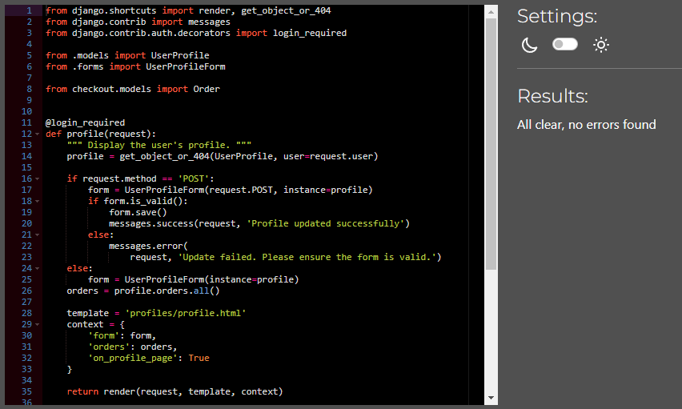
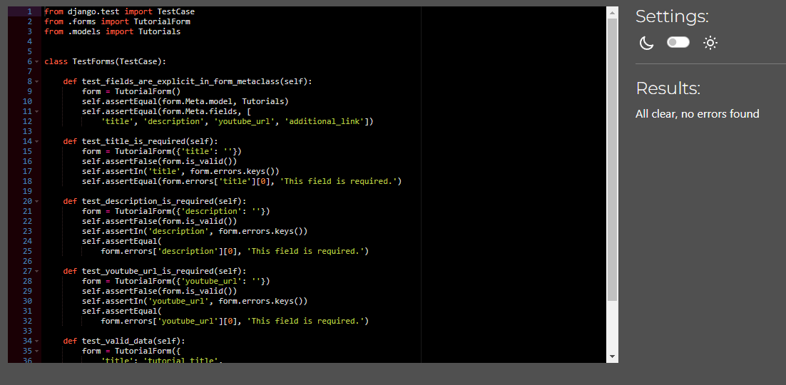
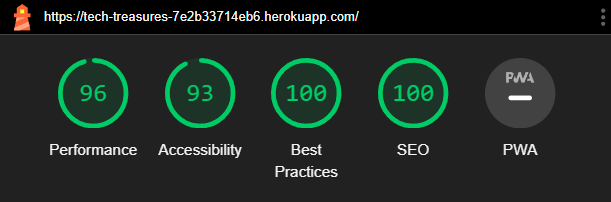
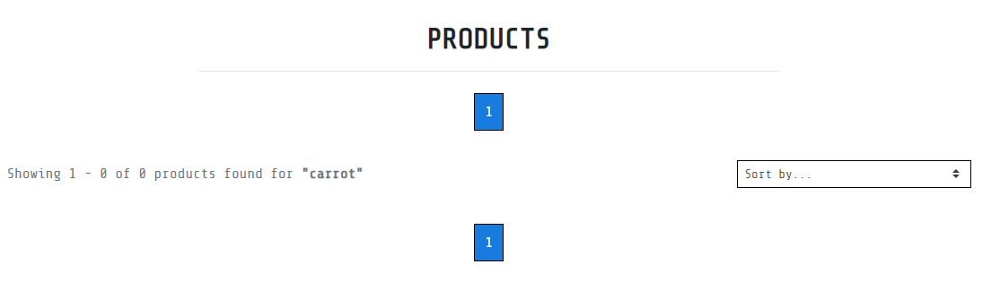
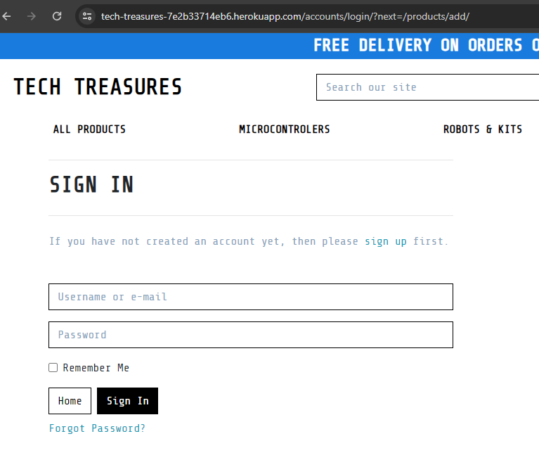
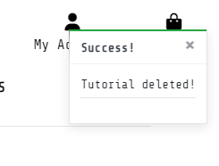
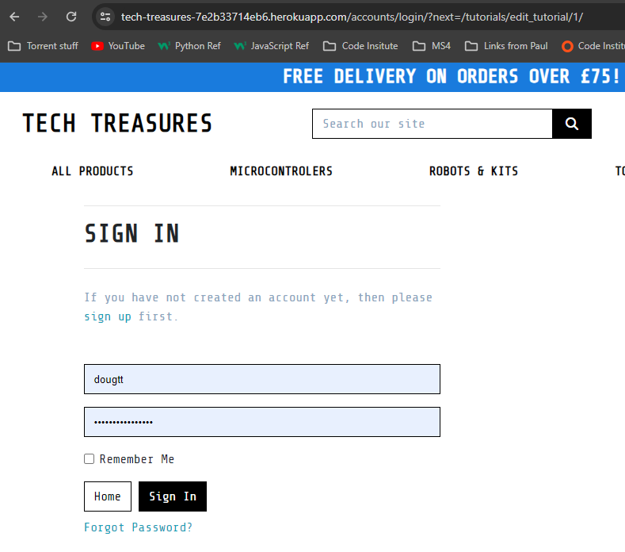
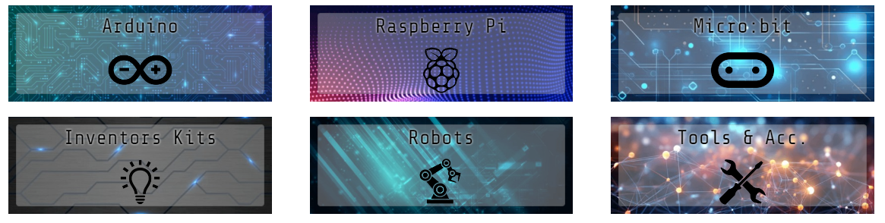
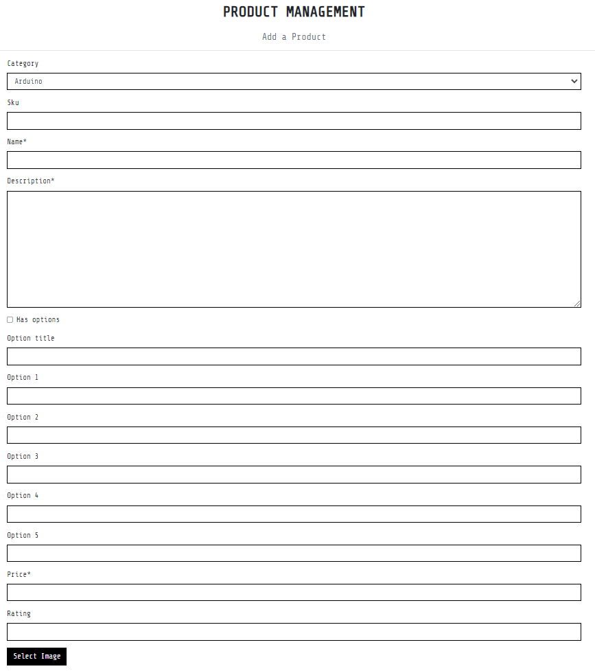
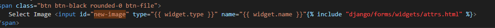

# Testing

Return back to the [README.md](README.md) file.

## Code Validation

### HTML

I have used the recommended [HTML W3C Validator](https://validator.w3.org) to validate all of my HTML files.

| Page | W3C URL | Screenshot | Notes |
| --- | --- | --- | --- |
| Home | [W3C](https://validator.w3.org/nu/?doc=https%3A%2F%2Ftech-treasures-7e2b33714eb6.herokuapp.com%2F) |  | Pass: No Errors |
| Products | [W3C](https://validator.w3.org/nu/?doc=https%3A%2F%2Ftech-treasures-7e2b33714eb6.herokuapp.com%2Fproducts%2F) |  | Pass: No Errors |
| Product Details | [W3C](https://validator.w3.org/nu/?doc=https%3A%2F%2Ftech-treasures-7e2b33714eb6.herokuapp.com%2Fproducts%2F1%2F) |  | Pass: No Errors |
| Tutorials | [W3C](https://validator.w3.org/nu/?doc=https%3A%2F%2Ftech-treasures-7e2b33714eb6.herokuapp.com%2Ftutorials%2F) |  | Pass: No Errors |
| Contact | [W3C](https://validator.w3.org/nu/?doc=https%3A%2F%2Ftech-treasures-7e2b33714eb6.herokuapp.com%2Fcontact%2F) |  | Pass: No Errors |
| Sign Up | [W3C](https://validator.w3.org/nu/?doc=https%3A%2F%2Ftech-treasures-7e2b33714eb6.herokuapp.com%2Faccounts%2Fsignup%2F) |  | Pass: No Errors |
| Sign In | [W3C](https://validator.w3.org/nu/?doc=https%3A%2F%2Ftech-treasures-7e2b33714eb6.herokuapp.com%2Faccounts%2Flogin%2F) |  | Pass: No Errors |
| Shopping Basket | [W3C](https://validator.w3.org/nu/?doc=https%3A%2F%2Ftech-treasures-7e2b33714eb6.herokuapp.com%2Fbasket%2F) |  | Pass: No Errors |
| Checkout | n/a |  | Empty Heading Warning |
| Add Product | n/a |  | Pass: No Errors |
| Edit Product | n/a |  | Pass: No Errors |
| Profile | n/a |  | Pass: No Errors |
| Order History | n/a |  | Pass: No Errors |
| Admin Contact | n/a |  | Pass: No Errors |
| Admin Contact Reply | n/a |  | Pass: No Errors |

### CSS

I have used the recommended [CSS Jigsaw Validator](https://jigsaw.w3.org/css-validator) to validate all of my CSS files.

| File | Jigsaw URL | Screenshot | Notes |
| --- | --- | --- | --- |
| base.css | n/a |  | Pass: No Errors |
| profile.css | n/a |  | Pass: No Errors |
| checkout.css | n/a |  | Pass: No Errors |

### JavaScript

I have used the recommended [JShint Validator](https://jshint.com) to validate all of my JS files.

| File | Screenshot | Notes |
| --- | --- | --- |
| countryfield.js |  | Pass: No Errors |
| stripe_elements.js |  | Pass: No Errors |

### Python

I have used the recommended [PEP8 CI Python Linter](https://pep8ci.herokuapp.com) to validate all of my Python files.

| File | App  |  CI URL | Screenshot | Notes |
| --- | --- | --- | --- | --- |
| apps.py | basket | [PEP8 CI](https://pep8ci.herokuapp.com/https://raw.githubusercontent.com/dougyb83/tech-treasures/main/basket/apps.py) |  | Pass: No Errors |
| contexts.py | basket | [PEP8 CI](https://pep8ci.herokuapp.com/https://raw.githubusercontent.com/dougyb83/tech-treasures/main/basket/contexts.py) |  | Pass: No Errors |
| urls.py | basket | [PEP8 CI](https://pep8ci.herokuapp.com/https://raw.githubusercontent.com/dougyb83/tech-treasures/main/basket/urls.py) |  | Pass: No Errors |
| views.py | basket | [PEP8 CI](https://pep8ci.herokuapp.com/https://raw.githubusercontent.com/dougyb83/tech-treasures/main/basket/views.py) |  | Pass: No Errors |
| admin.py | checkout | [PEP8 CI](https://pep8ci.herokuapp.com/https://raw.githubusercontent.com/dougyb83/tech-treasures/main/checkout/admin.py) |  | Pass: No Errors |
| apps.py | checkout | [PEP8 CI](https://pep8ci.herokuapp.com/https://raw.githubusercontent.com/dougyb83/tech-treasures/main/checkout/apps.py) |  | Pass: No Errors |
| forms.py | checkout | [PEP8 CI](https://pep8ci.herokuapp.com/https://raw.githubusercontent.com/dougyb83/tech-treasures/main/checkout/forms.py) |  | Pass: No Errors |
| models.py | checkout | [PEP8 CI](https://pep8ci.herokuapp.com/https://raw.githubusercontent.com/dougyb83/tech-treasures/main/checkout/models.py) |  | Pass: No Errors |
| signals.py | checkout | [PEP8 CI](https://pep8ci.herokuapp.com/https://raw.githubusercontent.com/dougyb83/tech-treasures/main/checkout/signals.py) |  | Pass: No Errors |
| urls.py | checkout | [PEP8 CI](https://pep8ci.herokuapp.com/https://raw.githubusercontent.com/dougyb83/tech-treasures/main/checkout/urls.py) |  | Pass: No Errors |
| views.py | checkout | [PEP8 CI](https://pep8ci.herokuapp.com/https://raw.githubusercontent.com/dougyb83/tech-treasures/main/checkout/views.py) |  | Pass: No Errors |
| webhook_handler.py | checkout | [PEP8 CI](https://pep8ci.herokuapp.com/https://raw.githubusercontent.com/dougyb83/tech-treasures/main/checkout/webhook_handler.py) |  | Pass: No Errors |
| webhooks.py | checkout | [PEP8 CI](https://pep8ci.herokuapp.com/https://raw.githubusercontent.com/dougyb83/tech-treasures/main/checkout/webhooks.py) |  | Pass: No Errors |
| apps.py | contact | [PEP8 CI](https://pep8ci.herokuapp.com/https://raw.githubusercontent.com/dougyb83/tech-treasures/main/contact/apps.py) |  | Pass: No Errors |
| forms.py | contact | [PEP8 CI](https://pep8ci.herokuapp.com/https://raw.githubusercontent.com/dougyb83/tech-treasures/main/contact/forms.py) |  | Pass: No Errors |
| models.py | contact | [PEP8 CI](https://pep8ci.herokuapp.com/https://raw.githubusercontent.com/dougyb83/tech-treasures/main/contact/models.py) |  | Pass: No Errors |
| urls.py | contact | [PEP8 CI](https://pep8ci.herokuapp.com/https://raw.githubusercontent.com/dougyb83/tech-treasures/main/contact/urls.py) |  | Pass: No Errors |
| views.py | contact | [PEP8 CI](https://pep8ci.herokuapp.com/https://raw.githubusercontent.com/dougyb83/tech-treasures/main/contact/views.py) |  | Pass: No Errors |
| test_forms.py | contact | [PEP8 CI](https://pep8ci.herokuapp.com/https://raw.githubusercontent.com/dougyb83/tech-treasures/main/contact/test_forms.py) |  | Pass: No Errors |
| test_models.py | contact | [PEP8 CI](https://pep8ci.herokuapp.com/https://raw.githubusercontent.com/dougyb83/tech-treasures/main/contact/test_models.py) |  | Pass: No Errors |
| test_views.py | contact | [PEP8 CI](https://pep8ci.herokuapp.com/https://raw.githubusercontent.com/dougyb83/tech-treasures/main/contact/test_views.py) |  | Pass: No Errors |
| apps.py | home | [PEP8 CI](https://pep8ci.herokuapp.com/https://raw.githubusercontent.com/dougyb83/tech-treasures/main/home/apps.py) |  | Pass: No Errors |
| urls.py | home | [PEP8 CI](https://pep8ci.herokuapp.com/https://raw.githubusercontent.com/dougyb83/tech-treasures/main/home/urls.py) |  | Pass: No Errors |
| views.py | home | [PEP8 CI](https://pep8ci.herokuapp.com/https://raw.githubusercontent.com/dougyb83/tech-treasures/main/home/views.py) |  | Pass: No Errors |
| test_views.py | home | [PEP8 CI](https://pep8ci.herokuapp.com/https://raw.githubusercontent.com/dougyb83/tech-treasures/main/home/test_views.py) |  | Pass: No Errors |
| admin.py | products | [PEP8 CI](https://pep8ci.herokuapp.com/https://raw.githubusercontent.com/dougyb83/tech-treasures/main/products/admin.py) |  | Pass: No Errors |
| apps.py | products | [PEP8 CI](https://pep8ci.herokuapp.com/https://raw.githubusercontent.com/dougyb83/tech-treasures/main/products/apps.py) |  | Pass: No Errors |
| forms.py | products | [PEP8 CI](https://pep8ci.herokuapp.com/https://raw.githubusercontent.com/dougyb83/tech-treasures/main/products/forms.py) |  | Pass: No Errors |
| models.py | products | [PEP8 CI](https://pep8ci.herokuapp.com/https://raw.githubusercontent.com/dougyb83/tech-treasures/main/products/models.py) |  | Pass: No Errors |
| urls.py | products | [PEP8 CI](https://pep8ci.herokuapp.com/https://raw.githubusercontent.com/dougyb83/tech-treasures/main/products/urls.py) |  | Pass: No Errors |
| views.py | products | [PEP8 CI](https://pep8ci.herokuapp.com/https://raw.githubusercontent.com/dougyb83/tech-treasures/main/products/views.py) |  | Pass: No Errors |
| widgets.py | products | [PEP8 CI](https://pep8ci.herokuapp.com/https://raw.githubusercontent.com/dougyb83/tech-treasures/main/products/widgets.py) |  | Pass: No Errors |
| apps.py | profiles | [PEP8 CI](https://pep8ci.herokuapp.com/https://raw.githubusercontent.com/dougyb83/tech-treasures/main/profiles/apps.py) |  | Pass: No Errors |
| forms.py | profiles | [PEP8 CI](https://pep8ci.herokuapp.com/https://raw.githubusercontent.com/dougyb83/tech-treasures/main/profiles/forms.py) |  | Pass: No Errors |
| models.py | profiles | [PEP8 CI](https://pep8ci.herokuapp.com/https://raw.githubusercontent.com/dougyb83/tech-treasures/main/profiles/models.py) |  | Pass: No Errors |
| urls.py | profiles | [PEP8 CI](https://pep8ci.herokuapp.com/https://raw.githubusercontent.com/dougyb83/tech-treasures/main/profiles/urls.py) |  | Pass: No Errors |
| views.py | profiles | [PEP8 CI](https://pep8ci.herokuapp.com/https://raw.githubusercontent.com/dougyb83/tech-treasures/main/profiles/views.py) |  | Pass: No Errors |
| asgi.py | tech-treasures | [PEP8 CI](https://pep8ci.herokuapp.com/https://raw.githubusercontent.com/dougyb83/tech-treasures/main/tech_treasures/asgi.py) |  | Pass: No Errors |
| settings.py | tech-treasures | [PEP8 CI](https://pep8ci.herokuapp.com/https://raw.githubusercontent.com/dougyb83/tech-treasures/main/tech_treasures/settings.py) |  | Pass: No Errors |
| urls.py | tech-treasures | [PEP8 CI](https://pep8ci.herokuapp.com/https://raw.githubusercontent.com/dougyb83/tech-treasures/main/tech_treasures/urls.py) |  | Pass: No Errors |
| wsgi.py | tech-treasures | [PEP8 CI](https://pep8ci.herokuapp.com/https://raw.githubusercontent.com/dougyb83/tech-treasures/main/tech_treasures/wsgi.py) |  | Pass: No Errors |
| apps.py | tutorials | [PEP8 CI](https://pep8ci.herokuapp.com/https://raw.githubusercontent.com/dougyb83/tech-treasures/main/tutorials/apps.py) |  | Pass: No Errors |
| urls.py | tutorials | [PEP8 CI](https://pep8ci.herokuapp.com/https://raw.githubusercontent.com/dougyb83/tech-treasures/main/tutorials/urls.py) |  | Pass: No Errors |
| views.py | tutorials | [PEP8 CI](https://pep8ci.herokuapp.com/https://raw.githubusercontent.com/dougyb83/tech-treasures/main/tutorials/views.py) |  | Pass: No Errors |
| forms.py | tutorials | [PEP8 CI](https://pep8ci.herokuapp.com/https://raw.githubusercontent.com/dougyb83/tech-treasures/main/tutorials/forms.py) |  | Pass: No Errors |
| models.py | tutorials | [PEP8 CI](https://pep8ci.herokuapp.com/https://raw.githubusercontent.com/dougyb83/tech-treasures/main/tutorials/models.py) |  | Pass: No Errors |
| test_views.py | tutorials | [PEP8 CI](https://pep8ci.herokuapp.com/https://raw.githubusercontent.com/dougyb83/tech-treasures/main/tutorials/test_views.py) |  | Pass: No Errors |
| test_forms.py | tutorials | [PEP8 CI](https://pep8ci.herokuapp.com/https://raw.githubusercontent.com/dougyb83/tech-treasures/main/tutorials/test_forms.py) |  | Pass: No Errors |
| test_models.py | tutorials | [PEP8 CI](https://pep8ci.herokuapp.com/https://raw.githubusercontent.com/dougyb83/tech-treasures/main/tutorials/test_models.py) |  | Pass: No Errors |

## Browser Compatibility

I've tested my deployed project on multiple browsers to check for compatibility issues.

| Browser | Home | Products | Product Details | Contact | Tutorials | Notes |
| --- | --- | --- | --- | --- | --- | --- |
| Chrome |  |  |  |  |  | Works as expected |
| Firefox |  |  |  |  |  | Works as expected |
| Edge |  |  |  |  |  | Works as expected |

## Responsiveness

I've tested my deployed project on multiple devices to check for responsiveness issues.

| Device | Home | Products | Product Details | Contact | Tutorials | Notes |
| --- | --- | --- | --- | --- | --- | --- |
| Mobile (DevTools) |  |  |  |  |  | Works as expected |
| Tablet (DevTools) |  |  |  |  |  | Works as expected |
| Desktop |  |  |  |  |  | Works as expected |
| XL Monitor |  |  |  |  |  | Works as expected |
| Samsung S21 Ultra |  |  |  |  |  | Works as expected |

## Lighthouse Audit

I've tested my deployed project using the Lighthouse Audit tool to check for any major issues.

| Page | Mobile | Desktop | Notes |
| --- | --- | --- | --- |
| Home |  |  | Some minor warnings on mobile |
| Products |  |  | Some minor warnings on mobile |
| Product Details |  |  | Some minor warnings on mobile |
| Basket |  |  | Some minor warnings on mobile |
| Checkout |  |  | Some minor warnings on mobile |
| Contact |  |  | Some minor warnings on mobile |
| Contact Admin |  |  | Some minor warnings on mobile |
| Admin Reply |  |  | Some minor warnings on mobile|
| Tutorials |  |  | Some minor warnings on mobile |
| Sign In |  |  | Some minor warnings on mobile |
| Sign Up |  |  | Some minor warnings on mobile |
| Add Product |  |  | Some minor warnings on mobile |
| Edit Product |  |  | Some minor warnings on mobile |

## Defensive Programming

Defensive programming was manually tested with the below user acceptance testing:

| Page | Expectation | Test | Result | Fix | Screenshot |
| --- | --- | --- | --- | --- | --- |
| Page Header | | | | | |
| | when the user enters a search term into the search bar and clicks the search icon (or presses enter on the keyboard) it is expected to load a product list of results relevant to the search term when matches are found | Tested the feature by entering a known search term and clicking the search icon and again by pressing enter | The feature behaved as expected, and loaded results relevant to the search term | Test concluded and passed |   |
| | The search bar is expected to load the products page with no results displayed when the user types a search term that has no matches and clicks the search icon or presses enter on the keyboard | Tested the feature by entering a search term that has no matches and clicking the search icon and again by pressing enter | The feature behaved as expected, and loaded the products page with zero results | Test concluded and passed |   |
| | The basket icon is expected to open the shopping basket page when the user clicks it, if items have been added to the basket a list of those items are expected to be displayed | Tested the feature by clicking the icon while items have been previously added | The feature behaved as expected, and it opened the shopping basket page and displayed a list of items added | Test concluded and passed |  |
| | The Tutorials link is expected to open the tutorials page when the user clicks it and display a list of tutorials from the database | Tested the feature by clicking the link | The feature behaved as expected, and it opened the tutorials page and displayed a list of tutorials | Test concluded and passed |  |
| | When clicking a sorting option from the 'All Products' dropdown menu the products page is expected to load a list of all products that has been sorted accordingly | Tested the feature by clicking each of the sorting options in the 'All Products' dropdown | The feature behaved as expected, and opened the products page displaying all products sorted in the order expected | Test concluded and passed |  |
| | When clicking a category from the remainig dropdown menus the products page is expected to load with a product list specific to the category selected | Tested the feature by clicking each of the categories in the dropdowns | The feature behaved as expected, and opened the products page and displayed a category specific list of products | Test concluded and passed |  |
| | When a standard (logged in) user or super user clicks 'My Profile' from the my account dropdown, the 'My Profile' page is expected to load. If the user has entered any delivery information or has made previous orders it is expected for this information to be displayed | Tested the feature by clicking the 'My Profile' link as a standard user and super user | The feature behaved as expected, and loaded the 'My Profile' page and displayed the users details and order history | Test concluded and passed |   |
| | When a super user clicks 'Product Management' from the My account dropdown, the 'Product Management' page is expected to load. | Tested the feature by clicking the 'Product Management' link | The feature behaved as expected, and loaded the 'Product Management' page | Test concluded and passed |   |
| | When a super user clicks 'Admin Messages' from the My account dropdown, the 'Admin Contact Page' is expected to load and display a list of messages accessed from the database. | Tested the feature by clicking the 'Admin Messages' link | The feature behaved as expected, and loaded the 'Admin Contact Page' accessing the database to display a list of messages | Test concluded and passed |   |
| Footer | | | | | |
| | Social links are expected to open the relevant site in a new tab when the user clicks the link | Tested the feature by clicking on each social link | The feature behaved as expected, and loaded the site in a new tab | Test concluded and passed |  |
| | The Tutorials link is expected to open the tutorials page when the user clicks it | Tested the feature by clicking the link | The feature behaved as expected, and it opened the tutorials page | Test concluded and passed |  |
| | The Contact Us link is expected to open the contact page when the user clicks it | Tested the feature by clicking the link | The feature behaved as expected, and it opened the contact page | Test concluded and passed |  |
| Profile | | | | | |
| | When a guest user attempts to access the 'My Profile' page by typing the URL into the browser, it is expected for them to be redirected to the "Sign In" page. | Tested the feature by entering `https://tech-treasures-7e2b33714eb6.herokuapp.com/profile/` into the browser | The feature behaved as expected, and redirected the user to the sign in page | Test concluded and passed |  |
| | When a standard user or super user adds or edits the delivery information and clicks 'Update Information' it is expected for that information to be saved and a toast message to be displayed confirming the successful update. | Tested the feature by entering data into the deliver information fields and clicking 'Update Information' | The feature behaved as expected, the data was saved and a toast message was displayed | Test concluded and passed |  |
| | When a standard user or super user clicks on an order number the order details are shown. | Tested the feature by clicking on an order number | The feature behaved as expected, and displayed the order details | Test concluded and passed |  |
| Products | | | | | |
| | When viewing the products page as a super user extra options should be available (eg edit/delete) | Tested by viewing the page as a super user | The page behaved as expected, and displayed the super user options | Test concluded and passed |  |
| | When viewing the products page as a guest or standard user, no super user options should be available (eg edit/delete) | Tested by viewing the page as a guest and standard user | The page behaved as expected, and did not display super user options | Test concluded and passed |  |
| | The product details page is expected to load when the user clicks on a product image | Tested the feature by clicking a product image | The feature behaved as expected and loaded the product details page for the specific product | Test concluded and passed |  |
| | When a super user clicks the edit link on a product it is expected that the edit product page will load for that specific product| Tested the feature by clicking edit on a product | The feature behaved as expected and loaded the edit product page for the specific product | Test concluded and passed |  |
| | When a super user clicks the delete link on a product it is expected that a delete confirmation modal is dispalyed | Tested the feature by clicking delete on a product | The feature behaved as expected and a delete confirmation modal was displayed | Test concluded and passed |  |
| | When a super user clicks Yes on the delete confirmation modal it is expected that the product is removed from the database and a toast message is displayed confirming the delete| Tested the feature by clicking Yes on the delete confirmation modal | The feature behaved as expected and deleted the product from the database and displayed a toast message | Test concluded and passed |  |
| Product Details | | | | | |
| | When viewing the product details page as a super user extra options should be available (eg edit/delete) | Tested by viewing the page as a super user | The page behaved as expected, and displayed the super user options | Test concluded and passed |  |
| | When viewing the product details page as a guest or standard user, no super user options should be available (eg edit/delete) | Tested by viewing the page as a guest and standard user | The page behaved as expected, and did not display super user options | Test concluded and passed |  |
| | When a super user clicks the edit link on a product it is expected that the edit product page is loaded for that specific product| Tested the feature by clicking edit on a product | The feature behaved as expected and loaded the edit product page for the specific product | Test concluded and passed |  |
| | When a super user clicks the delete link on a product it is expected that a delete confirmation modal is dispalyed | Tested the feature by clicking delete on a product | The feature behaved as expected and a delete confirmation modal was displayed | Test concluded and passed |  |
| | When a super user clicks Yes on the delete confirmation modal it is expected that the product is removed from the database and a toast message is displayed confirming the delete| Tested the feature by clicking Yes on the delete confirmation modal | The feature behaved as expected and deleted the product from the database and displayed a toast message | Test concluded and passed |  |
| | When any user clicks the Add to Basket button it is expected for the item to be added to the basket with the selected quantity and a toast message to be displayed confirming the item and quantity has been added| Tested the feature clicking the Add to Basket button | The feature behaved as expected, and it did Y | Test concluded and passed |  |
| Add Product | | | | | |
| | While logged in as a super user, and a valid form is submitted, the feature is expected to add a new product entry into the database, redirect the user to the new products details page and display a confirmation toast message | Tested the feature by entering data into the fields and clicking on "Add Product" | The feature behaved as expected, and added the new item to the database, redirected to the new product details page and displayed a confirmation message | Test concluded and passed |  |
| | If a guest user attempts to access the "Add Products" page it is expected that the user will be directed to the "Sign In" page | Tested the feature by attempting to access the "Add Product" page via the following url `https://tech-treasures-7e2b33714eb6.herokuapp.com/products/add/`  | The feature behaved as expected, and redirected the user to the "Sign In" page | Test concluded and passed |  |
| | If a standard user attempts to access the "Add Products" page it is expected that the user will be directed to the "Home" page and an "Access denied" message will be displayed | Tested the feature by attempting to access the "Add Product" page via the following url `https://tech-treasures-7e2b33714eb6.herokuapp.com/products/add/`  | The feature behaved as expected, and redirected the user to the "Home" page and displayed a toast message | Test concluded and passed |  |
| Edit Product | | | | | |
| | While logged in as a super user the feature is expected to make changes to an existing product and save them to the database, redirecting the user to the products details page and displaying a confirmation toast message when the user submits a valid form | Tested the feature by editing data in the fields and clicking on "Update Product" | The feature behaved as expected, and edited the item in the database, redirected to the products details page and displayed a confirmation message | Test concluded and passed |  |
| | If a guest user attempts to access the "Edit Products" page it is expected that the user will be directed to the "Sign In" page | Tested the feature by attempting to access the "Edit Product" page via the following url `https://tech-treasures-7e2b33714eb6.herokuapp.com/products/edit/1/`  | The feature behaved as expected, and redirected the user to the "Sign In" page | Test concluded and passed |  |
| | If a standard user attempts to access the "Edit Products" page it is expected that the user will be directed to the "Home" page and an "Access denied" message will be displayed | Tested the feature by attempting to access the "Edit Products" page via the following url `https://tech-treasures-7e2b33714eb6.herokuapp.com/products/edit/1/`  | The feature behaved as expected, and redirected the user to the "Home" page and displayed a toast message | Test concluded and passed |  |
| Tutorials | | | | | |
| | When viewing the Tutorials page as a super user extra options should be available (eg add/edit/delete) | Tested by viewing the page as a super user | The page behaved as expected, and displayed the super user options | Test concluded and passed |  |
| | When viewing the Tutorials page as a guest or standard user, no super user options should be available (eg add/edit/delete) | Tested by viewing the page as a guest and standard user | The page behaved as expected, and did not display super user options | Test concluded and passed |  |
| | When a super user clicks the "Add" link it is expected that the "Add a New Tutorial" page is loaded | Tested the feature by clicking the "Add" link | The feature behaved as expected and loaded the "Add a New Tutorial" page | Test concluded and passed |  |
| | When a super user clicks the "Edit" link on a specific tutorial it is expected that the "Edit a Tutorial" page is loaded displaying details for that specific tutorial | Tested the feature by clicking "Edit" | The feature behaved as expected and loaded the "Edit a Tutorial" page and displayed details for the specific tutorial | Test concluded and passed |  |
| | When a super user clicks the "Delete" link on a tutorial it is expected that a delete confirmation modal is dispalyed | Tested the feature by clicking "Delete" on a tutorial | The feature behaved as expected and a delete confirmation modal was displayed | Test concluded and passed |  |
| | When a super user clicks Yes on the delete confirmation modal it is expected that the tutorial is removed from the database and a toast message is displayed confirming the delete| Tested the feature by clicking Yes on the delete confirmation modal | The feature behaved as expected and deleted the tutorial from the database and displayed a toast message | Test concluded and passed |  |
| Add Tutorial | | | | | |
| | While logged in as a super user the feature is expected to add a new tutorial entry into the database, redirect the user back to the "Tutorials" page and display a confirmation toast message when the user submits a valid form | Tested the feature by entering data into the fields and clicking on "Add Tutorial" | The feature behaved as expected, and added the new tutorial to the database, redirected to the tutorial page and displayed a confirmation message | Test concluded and passed |  |
| | If a guest user attempts to access the "Add Tutorials" page it is expected that the user will be directed to the "Sign In" page | Tested the feature by attempting to access the "Add Tutorial" page via the following url `https://tech-treasures-7e2b33714eb6.herokuapp.com/tutorials/add_tutorial/`  | The feature behaved as expected, and redirected the user to the "Sign In" page | Test concluded and passed |  |
| | If a standard user attempts to access the "Add Tutorials" page it is expected that the user will be directed to the "Home" page and an "Access denied" message will be displayed | Tested the feature by attempting to access the "Add Tutorial" page via the following url `https://tech-treasures-7e2b33714eb6.herokuapp.com/tutorials/add_tutorial/`  | The feature behaved as expected, and redirected the user to the "Home" page and displayed a toast message | Test concluded and passed |  |
| Edit Tutorial | | | | | |
| | While logged in as a super user the feature is expected to edit an existing tutorial entry from the database, redirect the user back to the "Tutorials" page and display a confirmation toast message when the user submits a valid form | Tested the feature by editing data in the fields and clicking on "Add Tutorial" | The feature behaved as expected, and updated the tutorial then redirected the user to the tutorial page and displayed a confirmation message | Test concluded and passed |  |
| | If a guest user attempts to access the "Edit Tutorials" page it is expected that the user will be directed to the "Sign In" page | Tested the feature by attempting to access the "Edit Tutorial" page via the following url `https://tech-treasures-7e2b33714eb6.herokuapp.com/tutorials/edit_tutorial/1/`  | The feature behaved as expected, and redirected the user to the "Sign In" page | Test concluded and passed |  |
| | If a standard user attempts to access the "Edit Tutorials" page it is expected that the user will be directed to the "Home" page and an "Access denied" message will be displayed | Tested the feature by attempting to access the "Edit Tutorial" page via the following url `https://tech-treasures-7e2b33714eb6.herokuapp.com/tutorials/edit_tutorial/1/`  | The feature behaved as expected, and redirected the user to the "Home" page and displayed a toast message | Test concluded and passed |  |
| Contact | | | | | |
| | Feature is expected to save the users message/contact details in the database for admin to reply handle. A confirmation email will be sent to the user and a notification email will be sent to admin. | Tested the feature by submitting a valid form | The feature behaved as expected, where confirmation and notification emails were sent to the user and admin respectively and a new database entry was made as can be seen in the admins message handling service. | Test concluded and passed |  |
| Admin Contact | | | | | |
| | When logged in as a super user and an unread message is clicked, the feature is expected to open that message for the user to reply to if they choose. This will set the message as read in the database and when the user returns to the message list the text will no longer be bold. Indicating its 'read' status.  | Tested the feature clicking an unread message and returning back to the message list | The feature behaved as expected, and marked the message as read | Test concluded and passed |   |
| | When logged in as a super user a message is expected to be given the 'have replied' status when the user clicks a message and submits a reply. A toast message is also displayed | Tested the feature by clicking a message that has not yet been replied to and sending a reply to the customer | The feature behaved as expected, and it marked the message as being replied to and displayed a toast message | Test concluded and passed |   |
| | When logged in as a super user the delete button is expected to delete the message from the database when the user clicks on delete and clicks yes to confirm. A toast message is displayed | Tested the feature by clicking on delete and confirming the delete | The feature behaved as expected, and the message was removed from the database and a toast message was displayed | Test concluded and passed |   |
| | If a guest user attempts to access the "Admin Contact" page it is expected that the user will be directed to the "Sign In" page. | Tested the feature by attempting to access the "Admin Contact" page via the following url `https://tech-treasures-7e2b33714eb6.herokuapp.com/contact/admin-contact/`  | The feature behaved as expected, and redirected the user to the "Home" page and displayed a toast message | Test concluded and passed |  |
| | If a standard user attempts to access the "Admin Contact" page it is expected that the user will be directed to the "Sign In" page | Tested the feature by attempting to access the "Admin Contact" page via the following url `https://tech-treasures-7e2b33714eb6.herokuapp.com/contact/admin-contact/`  | The feature behaved as expected, and redirected the user to the "Sign In" page | Test concluded and passed |  |
| Basket | | | | | |
| | When there are items in the basket, the quantity and total price are expected to update and a confirmtion toast message is to be displayed when the user adjusts the quantity and clicks the "Update" link  | Tested the feature changing the quantity and clicking "Update" | The feature behaved as expected. The quantity and price were updated and a toast message was displayed | Test concluded and passed |  |
| | When there are items in the basket, the "Remove" link is expected to remove an item from the basket when it is clicked | Tested the feature by clicking remove | The feature behaved as expected and removed the item from the basket | Test concluded and passed |  |
| Checkout | | | | | |
| | When submitting a valid form and payment method, stripe payment is expected to be processed. The "Checkout Success" page is displayed and the order is added to the database | Tested the feature by submitting a valid form and payment method | The feature behaved as expected, payment was processed, "Checkout Success" was loaded and the order was saved to the database | Test concluded and passed |  |
| | If the user attempts to access the checkout page without any items in the basket it is expected that they will be redirected to the "Products" page and an "Error" toast message to be displayed | Tested the feature by entering the folling URL into the browser `https://tech-treasures-7e2b33714eb6.herokuapp.com/checkout/` | The feature behaved as expected and redirected the user to the "Products" page and displayed a toast message | Test concluded and passed |  |
| Sign Up | | | | | |
| | When the user submits a valid form it is expected that the user will be added to the database, a verification email will be sent and a toast message will display | Tested the feature by submitting a valid form | The feature behaved as expected, and the user was added to the database, a verification email was sent and a toast message was displayed | Test concluded and passed |  |
| Sign In | | | | | |
| | When the user submits a valid form it is expected that the user will be directed to the "Home" page and a toast message will be displayed | Tested the feature by submitting a valid form | The feature behaved as expected, and The user was directed to the "Home" page and a toast message was displayed | Test concluded and passed |  |

## User Story Testing

### New Site Users
| User Story | Screenshot |
| --- | --- |
| As a new site user, I would like to easily navigate to the main categories of products, so that I can quickly identify what the site offers. |  |
| As a new site user, I would like a responsive site layout that adjusts to my device's screen size, so that I can have a consistent experience whether on desktop, tablet, or mobile. |   |
| As a new site user, I would like to see my purchase total at all times, so that I don't overspend. |  |
| As a new site user, I would like to see social media icons prominently displayed, so that I can follow the company on my preferred platforms for updates. |  |
| As a new site user, I would like a clear and straightforward checkout process, so that I can finalize my purchase smoothly. |   |

### Returning Site Users

| User Story | Screenshot |
| --- | --- |
| As a returning site user, I would like a secure login and registration process, so that I can protect my personal information. |  |
| As a returning site user, I would like a dashboard where I can view and manage my orders, so that I can track my purchases and manage my account effectively. |  |
| As a returning site user, I would like to easily edit my personal information, so that I can update my details as needed. |  |
| As a returning site user, I would like to receive email confirmation when I register, so that I can verify my account easily. |  |

### Site Admin

| User Story | Screenshot |
| --- | --- |
| As a site administrator, I should be able to add new products. |  |
| As a site administrator, I should be able to edit existing products. |  |
| As a site administrator, I should be able to remove items from sale as necessary. |  |

## Automated Testing

I have conducted a series of automated tests on my application.

I fully acknowledge and understand that, in a real-world scenario, an extensive set of additional tests would be more comprehensive.

### Python (Unit Testing)

I have used Django's built-in unit testing framework to test the application functionality.

In order to run the tests, I ran the following command in the terminal each time:

`python3 manage.py test name-of-app `

To create the coverage report, I would then run the following commands:

`coverage run --source=name-of-app manage.py test`

`coverage report`

To see the HTML version of the reports, and find out whether some pieces of code were missing, I ran the following commands:

`coverage html`

`python3 -m http.server`

Below are the results from the various apps on my application that I've tested:

| App | File | Coverage | Screenshot |
| --- | --- | --- | --- |
| Contact | test_forms.py | 100% |  |
| Contact | test_models.py | 100% | - |
| Contact | test_views.py | 74% | - |
| Tutorials | test_forms.py | 100% |  |
| Tutorials | test_models.py | 100% | - |
| Tutorials | test_views.py | 71% | - |
| Home | test_views.py | 100% |  |

## Bugs

- Python - `UnorderedObjectListWarning: Pagination may yeild inconsistant results`

    

    - To fix this, I added a Meta class to the Product Class in products/models.py that ordered the products.

- Python - Pagination not keeping category filter
    - pagination would work correctly when viewing all product but when adding a category filter to a page pagination would default back to viewing all products without the category filters applied.

    

    - To fix this, it was necessary to get the current params from the url and concatenate it to the pagination param in order to correctly paginate through the filtered products.

- Python `'TypeError'` when trying to register a new account on Heroku

     

    - To fix this, I found a solution on slack to inlude a runtime.txt file in the root directory to specify which version of Python Heroku should use.

- HTML - Product optiions not being added to the basket
    - A bug was found when adding a second item to the basket where the second item is the same as the first item but with a different option selected (For example a 4GB and 8GB option).
What I discovered is that although the default option was highlighted, the radio button was not checked by default. This meant that if an item was added to the basket while leaving the default option highlighed the item was added but with no value for the option supplied. When a duplicate item was added but with an option highlighted and checked it created a conflict.

      

    - To fix this, when the radio buttons are being populated on product_details.html by the jinja for loop, I added an if statement that adds the `checked` attribute on the first iteration of that loop.

- HTML - Number of product per page does not show when product list is only one page long.

     

    - To fix this, I added an else statement to the template logic that handles displaying the product count per page. The logic previously only handled lists that were greater than one page long.

- HTML `Duplicate attribute id`
    - A duplicate `id` was discovered during HTML validation. On further inspection using 'view page source' in the browser and checking the relevant code in my repository I found that I was manually dreating an `id` on the input element of the custom_clearable_file_input.html. However in that same element I am using an include for django form widgets, this include was also dynamically adding an `id` of its own; creating the duplicate.

       

    - To fix this, I removed the `id` I had added and instead I targeted the `id` created by the include.

## Unfixed Bugs

There are no remaining bugs that I am aware of.
